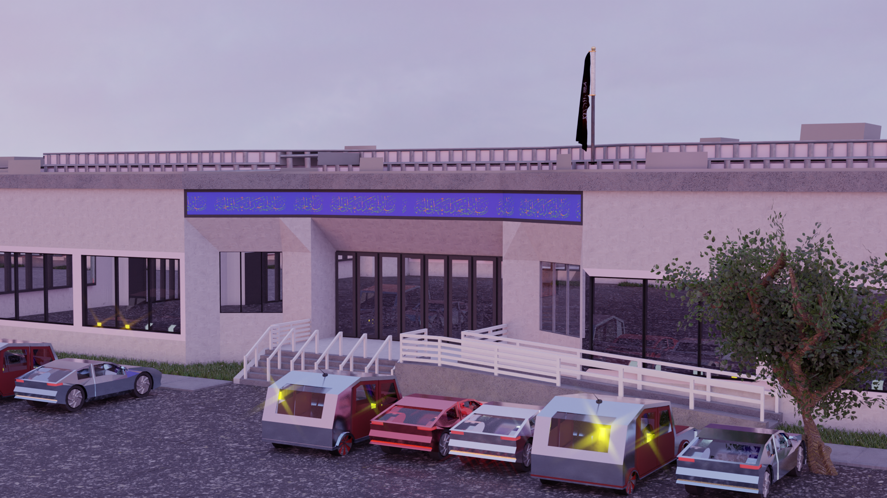

# saba3D
> ### A repository for 3D models of SABA Islamic Center.

**Project 1:** Accurate 3D Model of SABA, CA
_(Complete)_

- [x] Get map data
- [x] Add stairs and railings
- [x] Model women's entrance
- [x] Model RISE side
- [x] Add sidewalk
- [x] Add floor plan
- [x] Add reference
- [x] Name meshes
- [x] Add flag with cloth sim

**Project 2:** Build Environment Around 3D Model, Add Textures, Finish Outside
_(In Progress)_

- [x] Add HDRi
- [x] UV unwrap
- [x] Add borders to windows
- [x] Add two concrete textures
- [ ] Texture painted parking spaces
- [x] Add grass
- [ ] Add blue banner
- [ ] Add trees
- [x] Add cars
- [ ] Texture ground
- [ ] Animate flag

**Project 3:** Start On Inside
_(Not Started)_

- [ ] Full inside floorplan
- [ ] 3D scans?

---

_Blend file not present due to file size limitations. Email hayaanrizvi@gmail.com for access to it._
